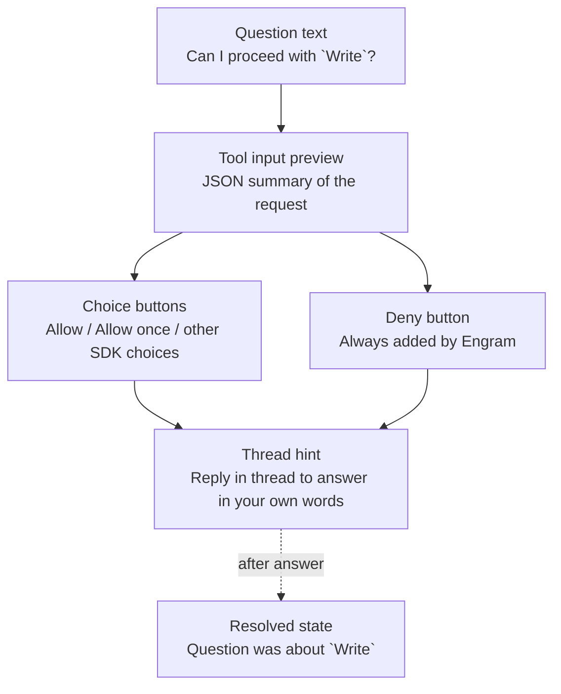
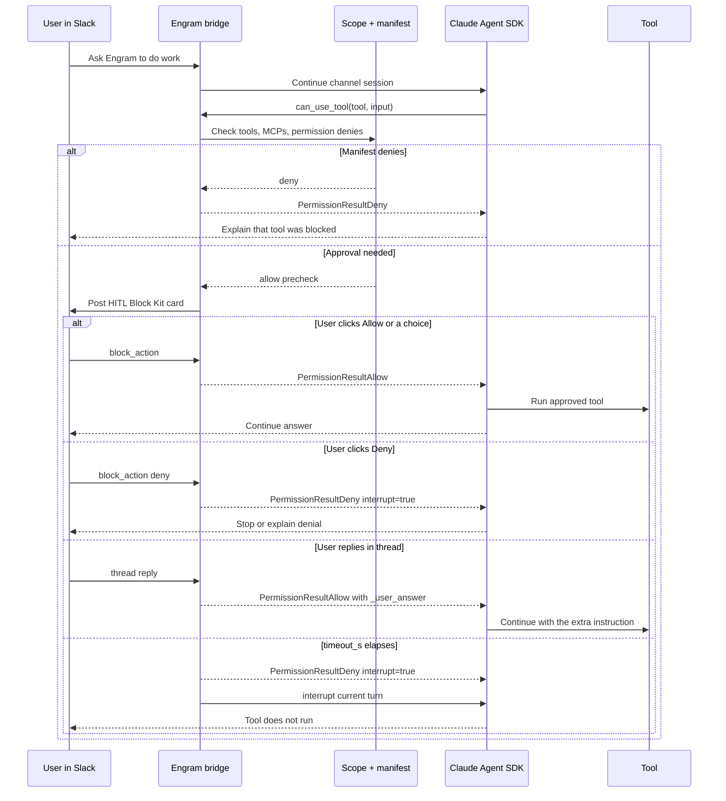

# Human-in-the-Loop (HITL)

Human-in-the-loop, or HITL, is Engram's safety pause for actions that should not happen silently. When Claude reaches a tool call that needs human approval, Engram pauses the current turn, posts a Slack card with the requested tool and choices, waits for your answer, then returns that answer to the Claude Agent SDK before the tool runs.

## What is HITL?

HITL is the Slack permission gate between Claude and sensitive tools. It exists so Engram can be useful without giving every Slack channel unlimited write, shell, or secret-reading power. Instead of guessing, Engram asks in the same Slack conversation where the request happened, records your choice, and either lets Claude continue with the approved tool call or denies and interrupts the turn.

## When does it fire?

HITL is attached to Claude's awaited `can_use_tool` callback. That detail matters: the SDK waits for this callback before dispatching the tool, so the card is a real gate, not a notification after the fact.

The decision path is:

1. Claude proposes a tool call.
2. Engram checks the channel manifest scope first.
3. If scope denies the call, Engram denies it immediately and does not post a Slack card.
4. If scope allows the call but Claude still needs explicit approval, Engram posts a HITL card.
5. If you approve, Claude receives an allow result and the tool can run.
6. If you deny, ignore the card until timeout, or exceed the daily cap, Claude receives a deny result.

In practice, prompts appear for tools that the Claude Agent SDK treats as approval-worthy under `permission_mode: default`. Common examples are file writes, file edits, shell commands, notebook edits, or tool calls where Claude offers explicit permission suggestions.

HITL only runs where it is enabled for the channel:

```yaml
hitl:
  enabled: true
  timeout_s: 300
  max_per_day: 5
```

Owner DMs and task-assistant channels both enable HITL by default, but their scopes differ. Owner DMs inherit user settings and allow more tools, so you are more likely to see a card for `Write`, `Edit`, or `Bash`. Task-assistant channels are stricter because they are shared rooms.

For a concrete shared-channel deny list, see [`src/engram/templates/manifests/task-assistant.yaml`](../src/engram/templates/manifests/task-assistant.yaml). Its default `tools.disallowed` block denies these write-side and shell tools before HITL can ask:

```yaml
tools:
  disallowed:
    - Bash
    - BashOutput
    - KillShell
    - Write
    - Edit
    - NotebookEdit
```

That same template also denies common secret paths through native Claude Code permission rules:

```yaml
permissions:
  deny:
    - "Read(~/.ssh/**)"
    - "Read(~/.aws/**)"
    - "Read(~/.gnupg/**)"
    - "Read(~/.config/**)"
    - "Read(**/.env*)"
```

Those scope and permission denies are intentionally different from HITL prompts. A deny rule says "never ask here." HITL says "ask the human before this specific tool call proceeds."

## Reading the Card

A tool-permission HITL card is posted as a Slack Block Kit message in the same channel as the original request. It contains the requested tool, a compact JSON summary of the tool input, the SDK-provided approval choices, a Deny button, and a note that you can reply in thread.

Example card shape:

```text
+-------------------------------------------------------------+
| Can I proceed with `Write`?                                 |
+-------------------------------------------------------------+
| {                                                           |
|   "file_path": "/tmp/example.txt",                          |
|   "content": "..."                                          |
| }                                                           |
+-------------------------------------------------------------+
| [Allow]  [Allow once]  [Deny]                               |
+-------------------------------------------------------------+
| Or reply in this thread to answer in your own words.        |
| Times out in 5 minutes.                                     |
+-------------------------------------------------------------+
```

Card anatomy:



The button row can vary because Claude supplies the positive choices. You may see one generic Allow-style choice, multiple choices, or labels such as "Allow once." Engram appends the red `Deny` button every time.

After you answer, Engram edits the original card and removes the buttons:

```text
+-------------------------------------------------------------+
| Answered: Allow once                                        |
+-------------------------------------------------------------+
| Question was about `Write`.                                 |
+-------------------------------------------------------------+
```

The "Question was about `Write`" line is useful when a thread has several tool-related messages. It is a compact reminder of which tool the resolved card controlled.

### Card Fields

| Card area | What it means |
| --- | --- |
| `Can I proceed with <Tool>?` | The exact Claude tool name being gated, such as `Write`, `Edit`, or `Bash`. |
| JSON block | Truncated tool input. For a write, this usually includes the file path and a preview of content. |
| Allow or choice buttons | Approval options from Claude's permission suggestion. Clicking one returns allow to the SDK. |
| `Deny` | Returns deny with interrupt. Claude stops the current tool turn instead of running the tool. |
| Thread note | You can reply in thread with free-form instructions instead of clicking a button. |
| Resolved context | After answer, shows which tool the card was about and removes stale buttons. |

## Permission Flow



## Configuration

HITL can be configured globally in `~/.engram/config.yaml` and per channel through that channel's manifest at:

```text
contexts/<channel-id>/.claude/channel-manifest.yaml
```

The manifest wins when it contains a `hitl` block. If a manifest does not define HITL settings, Engram falls back to the global config.

### Global Defaults

The built-in global defaults are:

```yaml
hitl:
  enabled: true
  timeout_s: 300
  max_per_day: 5
```

Field meanings:

| Field | Meaning |
| --- | --- |
| `hitl.enabled` | Turns the Slack permission gate on or off for the channel. |
| `hitl.timeout_s` | Number of seconds Engram waits for an answer before denying and interrupting the turn. |
| `hitl.max_per_day` | Maximum number of HITL cards Engram will open in that channel per UTC day. |

Values are normalized when loaded. `timeout_s` and `max_per_day` are converted to integers and clamped at zero or above.

### Owner-DM Default

Owner DMs are private and inherit user-level settings, so they get the global daily cap:

```yaml
setting_sources: [user]

tools: {}
mcp_servers: {}
skills: {}

hitl:
  enabled: true
  timeout_s: 300
  max_per_day: 5
```

Source: [`src/engram/templates/manifests/owner-dm.yaml`](../src/engram/templates/manifests/owner-dm.yaml).

Use this shape when you want Engram to have broad personal capability while still requiring a click before sensitive tool calls run.

### Task-Assistant Default

Task-assistant channels are shared by default. They start pending, use project-level settings, disallow shell and write tools, and use a lower daily HITL cap:

```yaml
status: pending
setting_sources: [project]

tools:
  disallowed:
    - Bash
    - BashOutput
    - KillShell
    - Write
    - Edit
    - NotebookEdit

hitl:
  enabled: true
  timeout_s: 300
  max_per_day: 3
```

Source: [`src/engram/templates/manifests/task-assistant.yaml`](../src/engram/templates/manifests/task-assistant.yaml).

Use this shape for team rooms where you want Engram to answer questions, search approved memory, and use safe project tools without giving the channel a shell or write access by default.

### Per-Channel Override

Edit the channel manifest to tune HITL for one Slack room:

```yaml
hitl:
  enabled: true
  timeout_s: 120
  max_per_day: 2
```

Common adjustments:

| Goal | Suggested setting |
| --- | --- |
| Reduce stale cards | Lower `timeout_s`, for example `120`. |
| Prevent prompt spam in a busy room | Lower `max_per_day`, for example `1` or `2`. |
| Disable HITL for non-interactive jobs | Set `enabled: false`. |
| Give the owner more review bandwidth | Keep owner-DM at `max_per_day: 5` or raise it locally. |

Do not disable HITL in a live Slack channel unless the channel's tool scope is already tight enough for unattended tool execution.

## Timeout Behavior

If no one answers before `hitl.timeout_s`, Engram denies the permission request and interrupts the active Claude turn. The tool does not run.

What you will see:

1. The original card is updated to a timeout state.
2. Claude receives `PermissionResultDeny(interrupt=True)`.
3. Engram calls `interrupt()` on the active SDK client when one is available.
4. The pending question is cleaned from Engram's in-memory registry.

The current Slack timeout update is intentionally short. It starts with:

```text
Question timed out
```

The current UI string still contains older "best guess" wording, but the actual permission result is deny plus interrupt. For behavior, trust the code path and logs, not the friendly Slack sentence fragment.

The canonical implementation log event is:

```text
hitl.question_timed_out
```

That timeout line includes the permission request ID and timeout value. To reconstruct the channel and tool, correlate it with the nearby `hitl.tool_guard_fired`, `hitl.question_registered`, and `hitl.question_posted` lines for the same turn.

Typical log sequence:

```text
hitl.tool_guard_fired tool_name=Write channel_id=C07TEST123
hitl.question_registered permission_request_id=...
hitl.question_posted slack_channel_ts=...
hitl.question_timed_out permission_request_id=... timeout_s=300
hitl.tool_guard_returned decision=deny duration_ms=300000
```

Older notes may refer to this generically as a HITL timeout. In current code, search for `hitl.question_timed_out`.

## Daily Cap

`hitl.max_per_day` limits how many HITL questions can be opened in one channel per UTC day.

When the cap is exceeded:

1. Engram does not post another card.
2. The permission request is auto-denied.
3. The denial message returned to Claude is `HITL rate-limited: daily question budget exhausted (<n>/day)`.
4. Claude should surface that warning in the Slack thread instead of asking the same question again.

The canonical rate-limit log event is:

```text
hitl.rate_limited
```

The returned decision still appears as:

```text
hitl.tool_guard_returned decision=deny
```

Caps exist to stop a confused or underspecified request from flooding a shared Slack channel with approval cards. They are especially important in task-assistant channels where multiple people may be talking to the same agent.

The limiter also allows only one open HITL card per channel. If another question is already pending, the next prompt is denied with:

```text
another question already pending in this channel
```

Answer or deny the existing card before retrying the request.

## Replying in Thread

You do not have to click a button. If the card asks for a decision and none of the buttons captures your intent, reply in the card's Slack thread.

Thread replies are routed back to Claude as an allow result with your text attached to the original tool input:

```json
{
  "_user_answer": "Please run only the focused pytest target."
}
```

Use a thread reply when you want to approve with constraints or clarification:

```text
Yes, but only edit docs/hitl.md.
```

```text
Run the focused test first. Do not run the full suite yet.
```

```text
Use /tmp/output.txt instead of the repo directory.
```

What happens internally:

1. Engram sees a Slack message whose `thread_ts` matches the pending card.
2. It checks for a pending question in that channel.
3. It resolves the permission request with `PermissionResultAllow`.
4. It copies your text into `_user_answer`.
5. It edits the card to show your answer and removes the buttons.

If a question is restricted to a specific responder, Engram ignores thread replies from other users. Most tool-permission cards do not set that restriction today.

## Debugging

Start with the structured logs. The useful command is:

```bash
engram logs --tail 300 | grep hitl
```

Filter to one channel when you know the Slack channel ID:

```bash
engram logs --tail 500 --channel C07TEST123 | grep hitl
```

Events to look for:

| Event | Meaning |
| --- | --- |
| `hitl.tool_guard_fired` | Claude requested a gated tool and Engram entered the blocking guard. |
| `hitl.question_registered` | Engram created an in-memory pending question. |
| `hitl.question_posted` | The Slack card was posted successfully. |
| `hitl.question_post_failed` | Engram could not post the card and denied the request. |
| `hitl.answer_received` | A Slack button or thread reply resolved the question. |
| `hitl.question_timed_out` | No answer arrived before `timeout_s`; Engram denied and interrupted. |
| `hitl.rate_limited` | The channel already had a pending card or hit `max_per_day`. |
| `hitl.tool_guard_returned` | The blocking guard returned allow or deny to Claude. |

For the live M4 demo, the healthy allow path looked like:

```text
hitl.tool_guard_fired    tool_name=Write
hitl.question_registered permission_request_id=...
hitl.question_posted     slack_channel_ts=...
hitl.answer_received     choice=0 decision=allow
hitl.tool_guard_returned decision=allow duration_ms=11104
```

The deny path looked like:

```text
hitl.tool_guard_fired
hitl.question_registered permission_request_id=...
hitl.question_posted     slack_channel_ts=...
hitl.answer_received     choice=deny decision=deny
hitl.tool_guard_returned decision=deny duration_ms=2115
```

Those timings came from the M4 live verification summarized in [`docs/m4-report.md`](m4-report.md).

### Checking `memory.db`

`~/.engram/memory.db` is not the source of truth for HITL internals. The pending permission registry is in memory, and the canonical event trail is in structured logs.

`memory.db` is still useful when you want to inspect what the user and assistant said around a HITL event. It stores ingested transcripts and summaries, so it can show the visible conversation that led to a card or followed a denial.

Inspect recent transcript rows for a channel:

```bash
sqlite3 ~/.engram/memory.db \
  "select ts, role, substr(text, 1, 160) from transcripts \
   where channel_id = 'C07TEST123' \
   order by ts desc limit 20;"
```

Search transcript text for visible HITL-related language:

```bash
sqlite3 ~/.engram/memory.db \
  "select ts, channel_id, role, substr(text, 1, 160) \
   from transcripts \
   where text like '%Question was about%' \
      or text like '%HITL rate-limited%' \
      or text like '%Deny%' \
   order by ts desc limit 20;"
```

If you need to prove whether a tool actually ran, use the logs first. The key check is ordering: the tool effect should occur after `hitl.answer_received decision=allow`, never before it. That ordering is the main safety contract of HITL.

## Quick Triage

| Symptom | Check |
| --- | --- |
| No card appears | Confirm `hitl.enabled: true`, the channel is approved, and the tool was not scope-denied before HITL. |
| Card appears but buttons do nothing | Look for `hitl.answer_received`; if absent, check Slack interactivity and action registration. |
| Card timed out | Search for `hitl.question_timed_out` and compare with the channel's `timeout_s`. |
| Request denied immediately | Check `hitl.rate_limited`, `scope.denied`, and manifest `tools.disallowed` or `permissions.deny`. |
| Too many cards | Lower `hitl.max_per_day` or tighten the channel manifest scope. |
| Need to approve with conditions | Reply in the card thread with the condition instead of clicking a button. |

## References

- [`src/engram/hitl.py`](../src/engram/hitl.py) is the canonical HITL state machine and log event source.
- [`src/engram/egress.py`](../src/engram/egress.py) renders and updates the Slack Block Kit card.
- [`src/engram/ingress.py`](../src/engram/ingress.py) handles button clicks and thread replies.
- [`src/engram/templates/manifests/owner-dm.yaml`](../src/engram/templates/manifests/owner-dm.yaml) shows owner-DM defaults.
- [`src/engram/templates/manifests/task-assistant.yaml`](../src/engram/templates/manifests/task-assistant.yaml) shows shared-channel defaults and deny examples.
- [`docs/m4-report.md`](m4-report.md) summarizes the M4 live demo and the GRO-426 blocking-gate fix.
