# Slack App Setup

Engram needs its own Slack app with Socket Mode enabled. This is a one-time
~5–10 minute manual step. Follow each numbered section in order.

> **Before you start**
>
> - Use a **personal Slack workspace**, not your company's. The screenshots in
>   this guide were captured in a personal workspace; some company workspaces
>   require admin approval before you can install custom apps, which adds a
>   delay this guide doesn't cover.
> - Have a browser tab open to <https://api.slack.com/apps>.
> - Set aside about 10 minutes for the first time. You'll move faster on
>   subsequent installs.

---

## 1. Create the app

Go to <https://api.slack.com/apps> and sign in if needed. You'll land on the
"Your Apps" page.

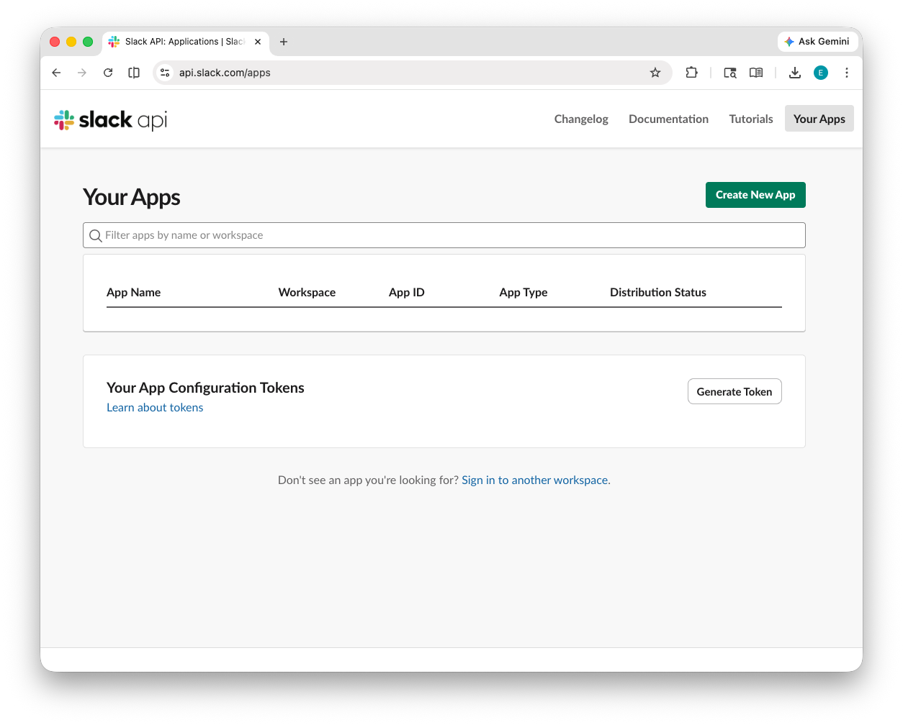

Click **Create New App** in the top right. A modal opens.

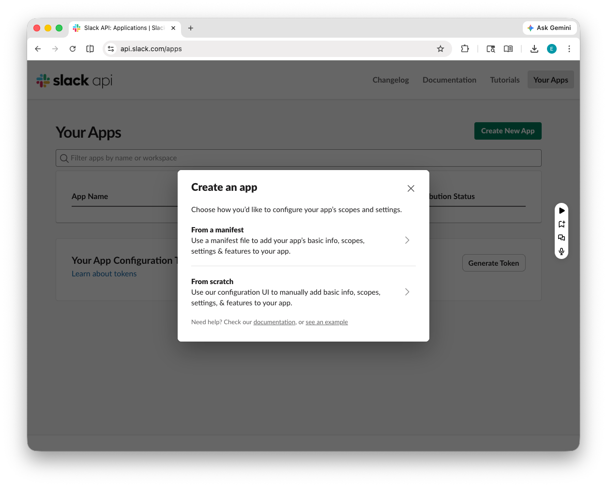

Click **From a manifest**. (We'll provide the manifest YAML in step 2 — it's
faster and less error-prone than hand-filling every setting.)

You'll be asked to pick a workspace.

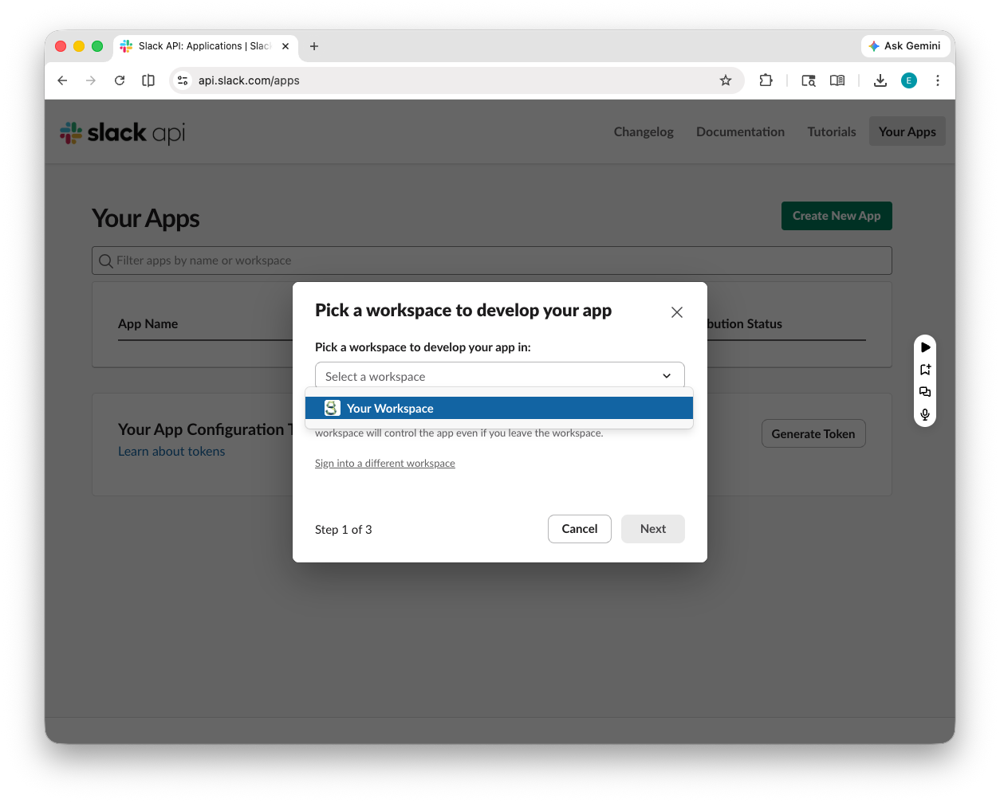

Choose your **personal** workspace (per the "Before you start" note above),
then click **Next**.

---

## 2. Manifest

You'll land on the manifest editor. Make sure the **YAML** tab is selected
(not JSON — the manifest below is YAML).

Copy the entire YAML block below and paste it into the editor:

```yaml
display_information:
  name: Engram
  description: Personal AI agent — per-channel memory and skills.
  background_color: "#1a1a1a"
features:
  bot_user:
    display_name: Engram
    always_online: true
  app_home:
    home_tab_enabled: false
    messages_tab_enabled: true
    messages_tab_read_only_enabled: false
  slash_commands:
    - command: /engram
      description: "Manage Engram channel MCP access, permission tiers, YOLO mode, and nightly-summary inclusion"
      usage_hint: "channels | mcp | upgrade | yolo | exclude | include"
      should_escape: false
    - command: /exclude-from-nightly
      description: "Exclude this channel from the nightly cross-channel summary"
      usage_hint: "Run in this channel to exclude it from tonight's summary"
      should_escape: false
    - command: /include-in-nightly
      description: "Include this channel in the nightly cross-channel summary"
      usage_hint: "Run in this channel to include it in tonight's summary"
      should_escape: false
oauth_config:
  scopes:
    bot:
      - app_mentions:read
      - channels:history
      - channels:read
      - chat:write
      - commands
      - files:read
      - files:write
      - groups:history
      - groups:read
      - im:history
      - im:read
      - im:write
      - mpim:history
      - mpim:read
      - reactions:read
      - reactions:write
      - users:read
settings:
  event_subscriptions:
    bot_events:
      - app_mention
      - message.channels
      - message.groups
      - message.im
      - message.mpim
  interactivity:
    # Block Kit button actions arrive over Socket Mode when interactivity is enabled.
    # They are not event_subscriptions and do not use an "actions" bot scope.
    is_enabled: true
  org_deploy_enabled: false
  socket_mode_enabled: true
  token_rotation_enabled: false
```

> **Slash commands are registered for you via the manifest.** You do not need
> to manually create `/engram` or the nightly-summary commands — they ship with
> the app.

> ℹ️ Running `engram setup` also writes this manifest to
> `/tmp/engram-slack-manifest.yaml` for convenience.

After pasting, your editor should look like this:

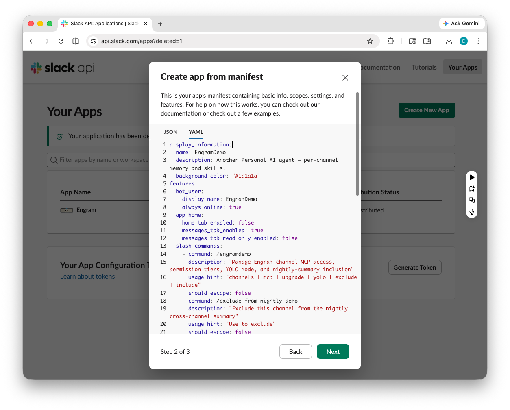

Click **Next**.

You'll see a review summary listing the permissions, scopes, and slash commands
the app is requesting. Read through it if you're curious, then click **Create**.

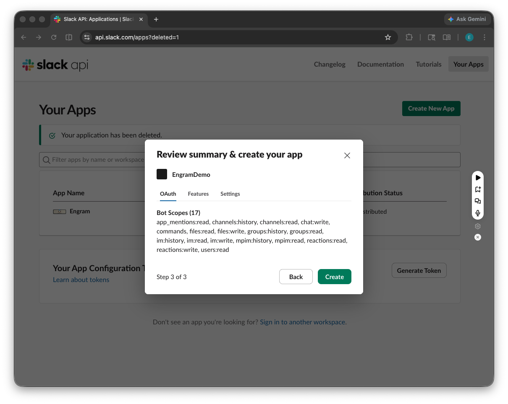

> **⚠️ "We can't translate a manifest with errors"?**
>
> If Slack shows that error message and the **Next** button stays disabled,
> you almost certainly already have an Engram app installed in this workspace.
> Slack enforces uniqueness on app names and slash commands — `/engram`,
> `/exclude-from-nightly`, and `/include-in-nightly` can each only be claimed
> once per workspace.
>
> The cleanest fix: create a new personal workspace at
> <https://slack.com/create> (takes ~90 seconds) and try again there. If you
> must reinstall in a workspace where Engram already exists, uninstall the
> existing Engram app first via **Settings → Manage apps**.

---

## 3. Install to your workspace

Once the app is created you land on its **Basic Information** page. Scroll up
to the top.

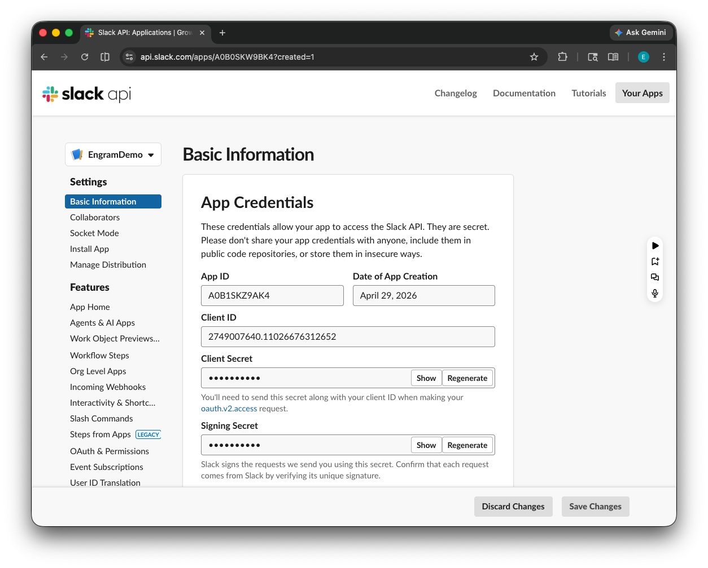

Click **Install to Workspace** (in the "Install your app" section near the
top of the page).

Slack shows a permission consent screen listing every scope the app is
requesting. This matches what you saw in the review step — that's expected.

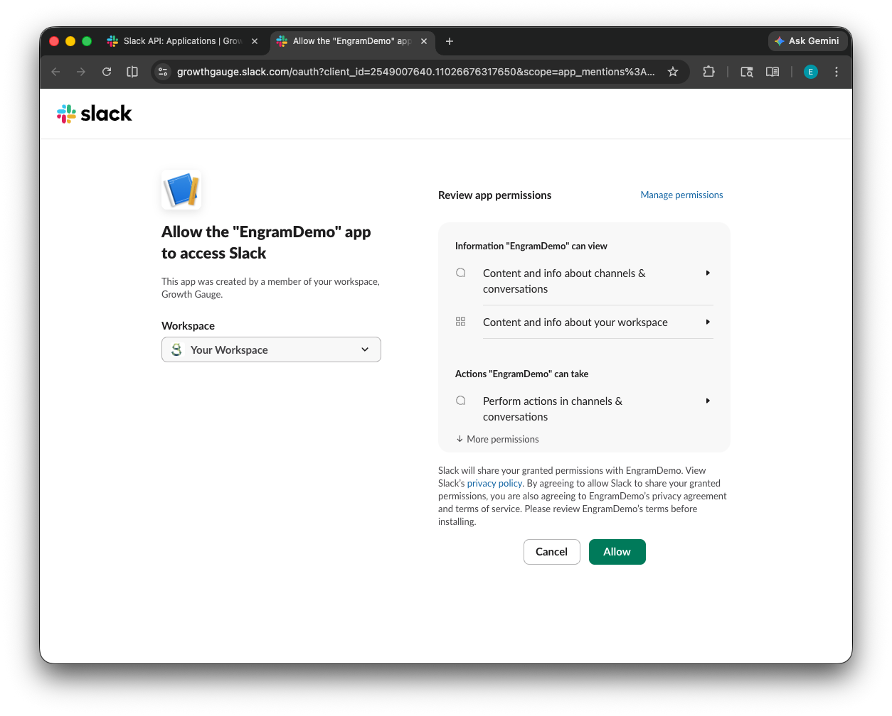

Click **Allow**.

---

## 4. Grab your tokens

Engram needs **two** tokens. They look similar but are different — pasting
the wrong one into `engram setup` is the #1 source of "the bridge isn't
working" reports. Take it slow here.

### 4a. Bot User OAuth Token (`xoxb-…`)

After clicking Allow, you land on the **OAuth & Permissions** page. The token
you want is at the top, under "OAuth Tokens" — labeled **Bot User OAuth Token**.
It starts with `xoxb-`.

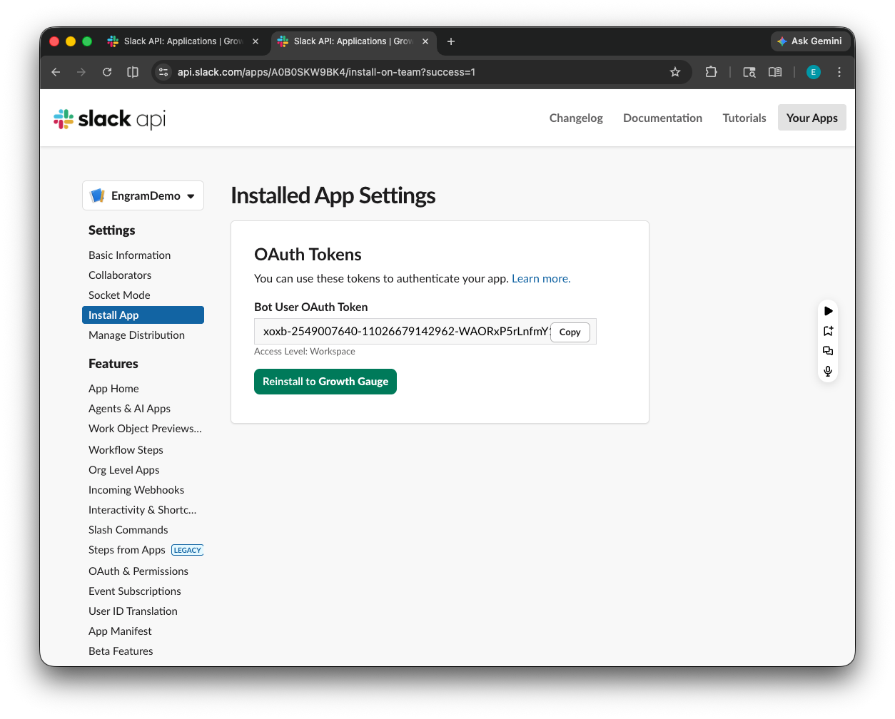

Click **Copy** next to that token. **Save it somewhere temporary** (a notes
app, a sticky note, anywhere you won't lose it for the next few minutes). You
will paste this into `engram setup` shortly.

### 4b. App-Level Token (`xapp-…`)

Click **Basic Information** in the left sidebar to navigate back. Scroll
down — past "App Credentials", "Display Information", and other sections —
until you find **App-Level Tokens**.

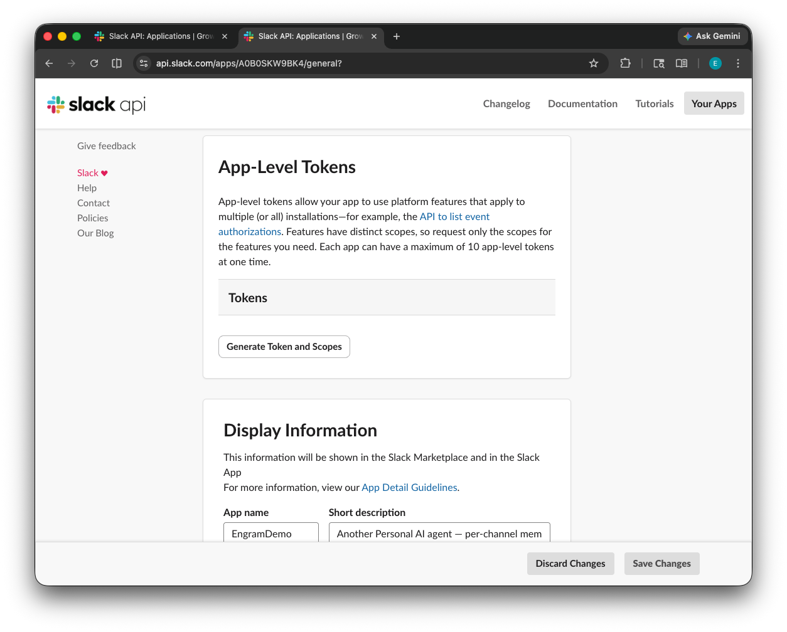

Click **Generate Token and Scopes**. A modal opens.

In the **Token Name** field, type something descriptive — `engram-socket` is a
good default.

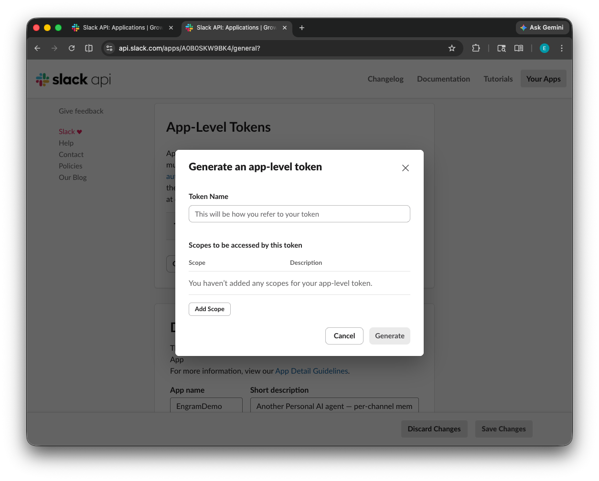

**Don't click Generate yet.** This token also needs a *scope* before it'll work.

Click **Add Scope**. A scope picker appears.

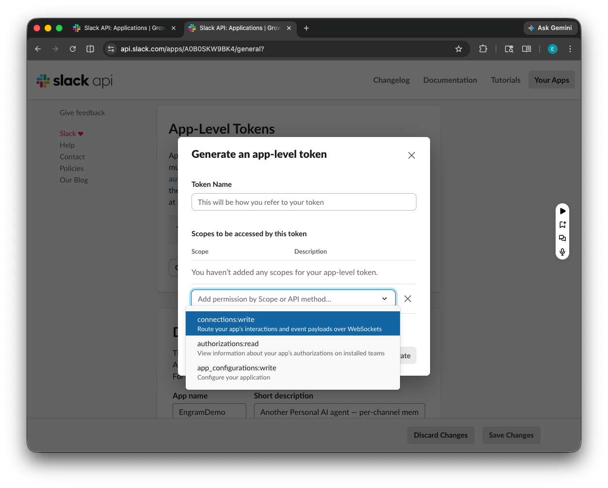

Select **`connections:write`**. (This is the only scope you need for
Socket Mode — it lets Engram receive messages without exposing a public
HTTPS endpoint.)

The modal now shows `connections:write` as a chip and the **Generate** button
becomes active.

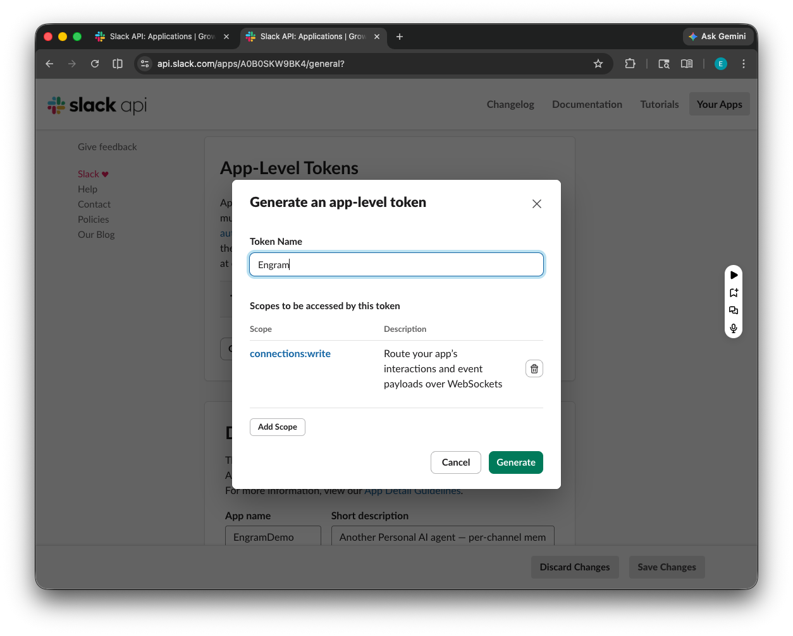

Click **Generate**. Slack reveals the new App-Level Token. It starts with
`xapp-`.

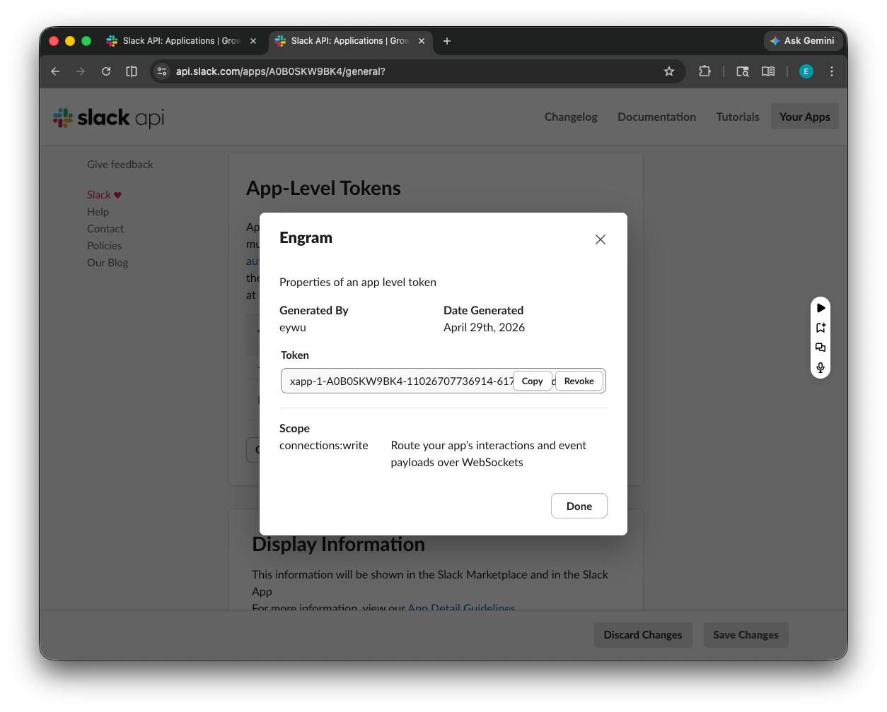

Click **Copy**, and save this one too.

> **⚠️ Don't mix them up.**
>
> - **`xoxb-…`** is the Bot User OAuth Token (from step 4a)
> - **`xapp-…`** is the App-Level Token (from step 4b)
>
> Both are needed. They go in different fields when you run `engram setup`.

---

## 5. Verify Socket Mode is on

Click **Socket Mode** in the left sidebar.

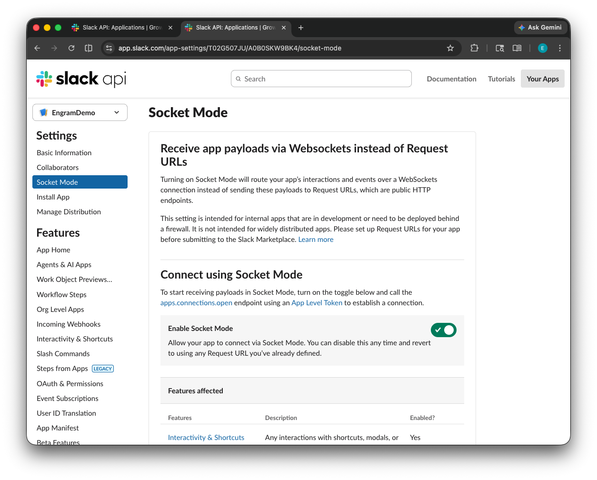

The **Enable Socket Mode** toggle should already be **on** — the manifest you
pasted in step 2 enabled it. If it's off for any reason, flip it on now.

Without Socket Mode, Engram cannot receive messages from Slack.

---

## 6. Run `engram setup`

Back in your terminal:

```bash
engram setup
```

The wizard will prompt you for both tokens. Paste them when asked:

- **Bot User OAuth Token** → the `xoxb-…` from step 4a
- **App-Level Token** → the `xapp-…` from step 4b

The wizard writes both to `~/.engram/config.yaml` with mode `600` so only
your user can read them.

---

## 7. Verify

```bash
engram status
```

This should show both tokens (masked) and report `claude CLI ✓` plus the MCP
inventory. If anything is red, run:

```bash
engram doctor
```

`engram doctor` walks 19 checks and tells you exactly what's wrong and how to
fix it.

---

## 8. Run the bridge

```bash
engram run
```

Then DM the Engram bot in Slack. You should get a Claude response within
~30 seconds.

🎉 You're done.

---

## Troubleshooting

| Symptom | Likely cause | Fix |
|---|---|---|
| "We can't translate a manifest with errors" | App name or slash command collision in this workspace | Use a fresh personal workspace, or uninstall the existing Engram app first |
| `engram setup` accepts tokens but `engram run` says "auth failed" | You probably pasted the same token in both fields | Re-run `engram setup`. `xoxb-…` for Bot User, `xapp-…` for App-Level. They are different tokens. |
| Bot doesn't respond to DMs | Socket Mode is off, or `engram run` isn't running | Check step 5 (Socket Mode toggle) and re-run `engram run` |
| Anything else | `engram doctor` will diagnose it | Run it and follow the suggestions |
